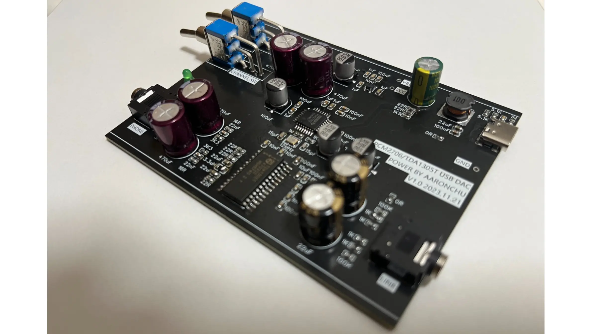
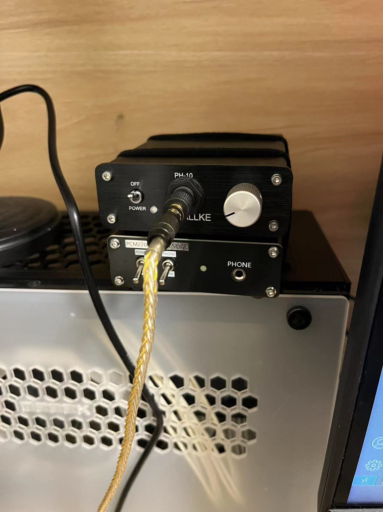
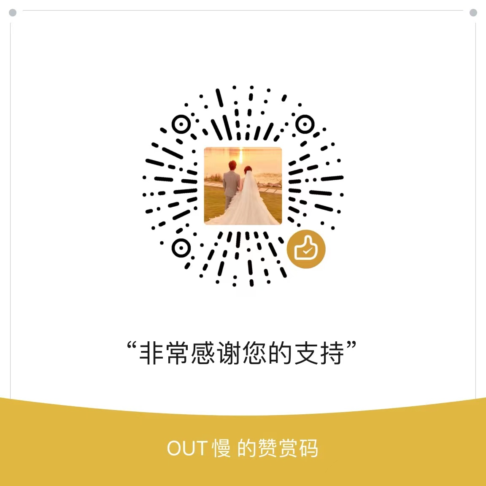

# PCM2706/TDA1305-USB-DAC

基于PCM2706和TDA1305的入门HIFI DAC解码器，代替主板的螃蟹声卡，USB输入3.5MM耳机输出，支持16bit音频解码，足够使用。

## 应用场景
替代主板自带声卡
入门级HIFI可接耳放，或直推耳塞。

## 参数
1. 接口：供电接口使用电脑USB接口供电，两组3.5MM音频输出接口，一组PCM2706直出可系统控制音量，一组IIS信号输出TDA1305解码只能软件或者接后级耳放控制音量；
2. 开关：两路扭子开关，一路控制电源通断，一路控制输出方式。
3. 工作电压：5v；
4. 制作成本：30-50元（主要是滤波电容选用音频专用电容会更贵）;

## 使用说明
直接连接电脑usb无需安装驱动即可使用，切换到LINE时由TDA1305输出，由于不经过声卡，无法系统控制音量，只能由播放软件控制或者接后级耳放控制，切换为PHONE时由PCM2706直出可系统控制音量，搭配HACKLABS的耳放使用更佳。

两路输出电容滤波建议采用专业的音频电容，目前我打板的那件底噪非常低几乎没有，芯片电源滤波几乎都采用了伊娜的音频电容。

目前使用下来的缺点就是利用IIC输出TDA1305解码时是无法通过系统调节音量，建议接后级耳放，目前我是配合hacklabs的耳放使用。

## 关于外壳

外壳采用铝型材外壳82*27-79-100mm 100mm长度的那款,前后面板的Gerber文件已经放到[hardwave](./)中

[购买地址](https://item.taobao.com/item.htm?_u=12ce6ade70dc&id=527187308231&spm=a1z09.2.0.0.51a82e8dtK0O1C)

## 请我喝咖啡
如果该项目对你有所帮助可以请我喝杯咖啡

